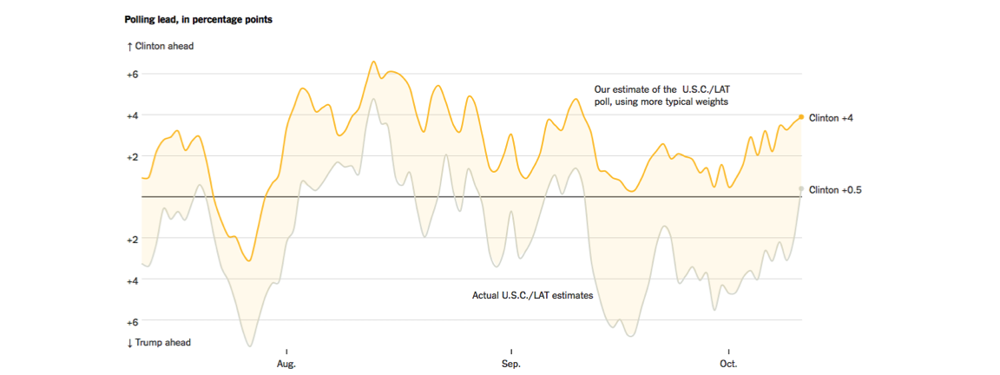
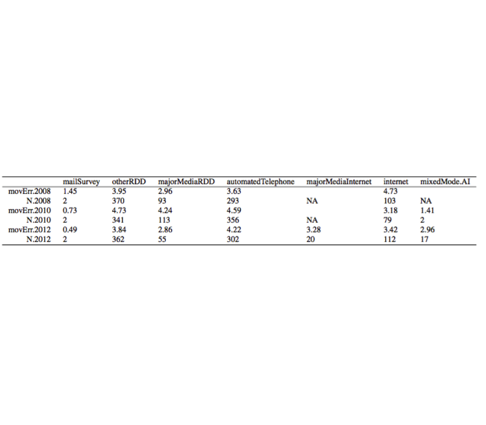

---
title       : Assessing Accuracy of Pre-Election Polls
subtitle    : 2008 - 2012
author      : MJ Cho
job         : PPRG Presentation
logo        : logo.png
framework   : io2012               # {io2012, html5slides, shower, dzslides, ...}
highlighter : highlight.js         # {highlight.js, prettify, highlight}
hitheme     : tomorrow             # 
widgets     : [mathjax, bootstrap, quiz] # {mathjax, quiz, bootstrap}
mode        : selfcontained        # {standalone, draft}
knit        : slidify::knit2slides

--- # Outline

## Outline

>- 1. Polls could be inaccurate, so what?
   - Cases of inaccurate polls... abundant!
   - Why does accuracy matter?
>- 2. Literature and hypotheses
   - Literature on the effects of on accuracy
>- 3. Methods
   - Variables
   - Data collection: 2 major stages
   - Analyses
   - Results
>- 4. Discussion 

--- #SoWhat1

## Inaccurate polls... so what?

So **why** should we care about poll accuracy?

>- 1. Predictable electoral outcomes is key to political and economic stability
   - Business Insider: When elections are predictable, it helps society — investors, job seekers, employers, and retirees — plan for the future. The EU Referendum caused the pound and the FTSE 100 to both immediately collapse because no one was expecting Leave to win.
>- 2. Polls inform voters: polls as a source of entertainment
>- 3. Polls provide feedback to candidates and elected officials
   - Altering positions and policies to accomodate what people want
>- 4. Polls could affect actual election results
   - Poll predictions provide strategic information for donors
>- 5. All in all, accurate polls based on scientific methods better serve its social functions.

--- #SoWhat2

## Inaccurate polls... so what?
### Just a couple of cases...

>- 1. Polls on referendum: The Brexit Case, fewer than a third of the 168 polls predicted a leave vote
   - CNBC: The inaccurate Brexit prediction is just one of multiple misses over recent years, including last year's U.K. general election, the Scottish referendum in 2014...
   - Chris Hanretty (Monkey Cage): "vote for the status quo" effect is smaller than expected in close referenda
   - Nate Cohn (The Upshot): referendum polls are often less accurate than general election polls, large numbers of undecided voters
   - Anthony Wells (YouGov): hard-to-reach voters (3 vs. 6 days in the field), under-educated people are under-represented, inaccurate attitude weights, reallocation of "don't knows".

--- #SoWhat3

## Inaccurate polls... so what?

>- 2. NYT: *How One 19-Year-Old Illinois Man Is Distorting National Polling Averages*
   - Overweighted (sub-)sample and the use of past vote 
   - Weighting over too many categories leads to overcounting
   - Weighting based on past vote, which is very inaccurate

--- #Lit1a

## Literature and hypotheses
### Mode and Accuracy
>- 1. Chang and Krosnick (2009): Internet data collection from a probability sample yields more accurate results than telephone interviewing and Internet data collection from nonprobability samples.
>- 2. Yeager et al. (2011): mode effects (telephone vs. internet and probability vs. non-probability) on accuracy.

--- #Lit1b
### Sample size
>- 1. Lohr (2010): The relationship between sample size and the margin of error of a survey is curvilinear.

--- #Lit2

## Literature and hypotheses
### Office of the Election
>- 1. Pasek et al. (2014): The primacy effect is smaller for high-visibility races but voters are generally more informed about presidential elections.

### Election year
>- 1. Silver and Krosnick (2014): Polls on referenda during presidential election years are less accurate.

### Partisanship
>- 1. Franklin (2014): Polls conducted by partisan sources overestimate support for the candidate they support by 2.9% on average.

--- #Methods1

## Methods
### Main Variables
>- 1. Dependent variables: Average absolute error, Margin of victory error, Partisan bias
   - Average absolute error: Average of the Republican and Democrat absolute errors
   - Margin of victory error: Margin of victory error between the poll and the actual election outcome
   - Partisan bias: aggregate count of partisanship of the firms involved
>- 2. Independent variables: Average number of days between poll and actual elections, Duration of the poll, Sample size, Registered vs. likely voters, Election year, Major national news media organization, Election type, Mode of poll

--- #Methods2

## Methods
### Data Collection
>- 1. Stage 1: Based on data from aggregate polling sites, collected the above main variables and other related poll and election characteristics. Sources include: FiveThirtyEight, Real Clear Politics, Pollster.com, FEC, and Secretary of State.
>- 2. Stage 2: In addition to the macro-partisan variable (3-level factor) collected in stage 1, collected micro-level partisan variable such that each of the firms involved was evaluated.
   - Firm's role in the poll (designer, collector, sponsor, and publisher) based on online information and case studies.
   - Partisanship based on firms' websites, donation records, and case studies.

--- #Results1a

## Results
### Descriptive Analyses

--- #Results1b

## Results
### Descriptive Analyses

--- #Results2a

## Results
### Statistical Analyses: Average absolute error

--- #Results2b

## Results
### Statistical Analyses: Average absolute error (cont.)

--- #Results3a

## Results
### Statistical Analyses: Margin of victory error

--- #Results3b

## Results
### Statistical Analyses: Margin of victory error (cont.)

--- #Results4a

## Results
### Statistical Analyses: Partisan bias

--- #Results4b

## Results
### Statistical Analyses: Partisan bias (cont.)

--- #Conclusion

## Conclusion
>- 1. Some hypotheses were supported...
   - Most of the election type and mode independent variables, the registered voter variable, the days in field variable, the sample size.
   - Accuracy variables yield different results.
>- 2. Partisanship and partisan bias
   - The hypothesis was also supported.
   - Is there a better way to quantify partisan bias?

